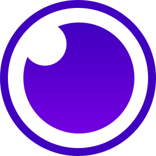

# Webapi Nodejs

[](LICENSE)
[](https://app.codecov.io/gh/leal32b/webapi-nodejs)
[](https://app.circleci.com/pipelines/github/leal32b/webapi-nodejs)
[](https://codeclimate.com/github/leal32b/webapi-nodejs/maintainability)
[](https://codeclimate.com/github/leal32b/webapi-nodejs/issues)
[](https://github.com/leal32b/webapi-nodejs/pulls)
[](https://github.com/leal32b/webapi-nodejs/issues)


This project aims to serve as a template for the creation of new Web APIs. Applying concepts of TDD (Test-Driven Development), DDD (Domain-Driven Design) and Clean Architecture, it comes with pre-built: user and profile management, events handling and the option to use SQL or noSQL databases.


<!--
## Table of Contents

- [Webapi Nodejs](#webapi-nodejs)
  - [Getting Started](#getting-started)
  - [Technologies & Tools](#technologies--tools)
  - [License](#license)
-->


## Getting Started

- Create a copy of `.env.development` and rename it to `.env`
- Run the following commands:
```bash
# Install dependencies:
npm install

# Build project:
npm run build

# Start containers (make sure docker is running on your machine):
npm run docker:up

# Run migrations:
npm run migration:run

# Endpoint will be listening at http://localhost:3000/api
```


## Technologies & Tools

<a rel="Node.js" href="https://nodejs.org"></a>
<a rel="TypeScript" href="https://www.typescriptlang.org"></a>
<a rel="Vitest" href="https://vitest.dev"></a>
<a rel="ESLint" href="https://eslint.org"></a>
<a rel="Standard " href="https://standardjs.com"></a>
<a rel="husky" href="https://typicode.github.io/husky"></a>
<a rel="lint-staged" href="https://github.com/okonet/lint-staged#readme"></a>
<a rel="jscpd" href="https://github.com/kucherenko/jscpd#readme"></a>
<a rel="Conventional Commits" href="https://www.conventionalcommits.org"></a>
<a rel="Express" href="https://expressjs.com"></a>
<a rel="Swagger" href="https://swagger.io"></a>
<a rel="Docker" href="https://www.docker.com"></a>
<a rel="PostgreSQL" href="https://www.postgresql.org"></a>
<a rel="MongoDB" href="https://www.mongodb.com"></a>
<a rel="Rabbitmq" href="https://www.rabbitmq.com"></a>
<a rel="CircleCI" href="https://circleci.com"></a>
<a rel="Codecov" href="https://about.codecov.io"></a>
<a rel="Code Climate" href="https://codeclimate.com"></a>
<a rel="Render" href="https://render.com"></a>
<a rel="VS Code" href="https://code.visualstudio.com"></a>
<a rel="DBeaver" href="https://dbeaver.io"></a>
<a rel="Insomnia" href="https://insomnia.rest"></a>


## License

Licensed under the [MIT](LICENSE) license.
